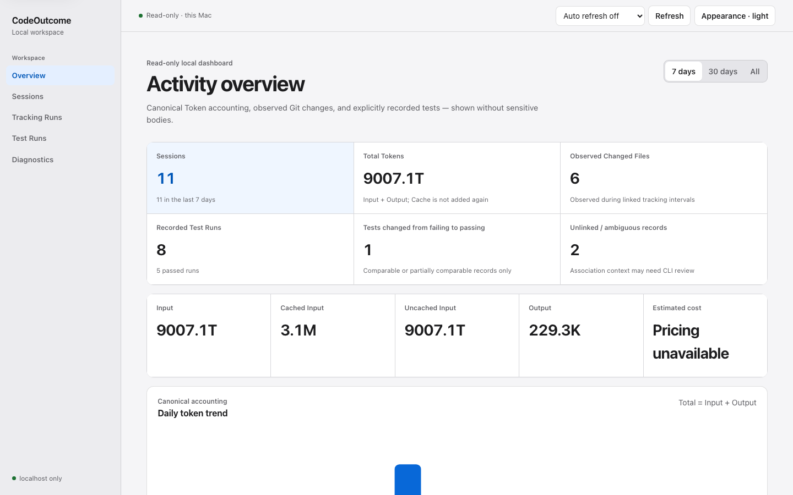

# CodeOutcome

Local-first session accounting and review for Claude Code and OpenAI Codex.

[](https://github.com/vsn75rgcpx-sudo/codeoutcome/actions/workflows/ci.yml)



- **Local-first:** SQLite stays on your machine; there is no telemetry.
- **Two Providers:** independent Claude Code and Codex log adapters.
- **Canonical Token accounting:** incremental, auditable, and cache-safe.
- **Observed Git changes:** interval metadata without full diffs or source bodies.
- **Recorded test results:** explicit aggregate runs and comparisons.
- **Read-only local Dashboard:** loopback-only API with a per-start token.

> **Public alpha — 0.1.0-alpha.2.** Install from npm or build from a trusted
> checkout. Log formats and metadata contracts may change. Claude Code support
> is synthetic-fixture tested only; Codex has local-log validation.

## Quick start

```sh
npm install --global codeoutcome
codeoutcome doctor --provider codex
codeoutcome import --provider codex
codeoutcome usage --weekly
codeoutcome dashboard
```

CodeOutcome saves accounting, repository, observed Git, and aggregate test
metadata. It does not save Prompt/response bodies, source code, complete diffs,
raw test output, environment variables, or credentials. The Dashboard is a
local web UI—not a desktop app or remote service—and must not be exposed through
a proxy or port forward. See [Privacy](PRIVACY.md).

Current limits: macOS is manually validated and Linux package installation is
validated on GitHub-hosted Ubuntu machines; Windows is blocked by package
metadata until verified. Claude Code compatibility is fixture-tested rather
than real-log validated. Pricing is a bundled versioned estimate and unknown
models remain unavailable. Provider formats may evolve; Git/test associations
describe context, never exact AI authorship. There is no telemetry, cloud sync,
account system, remote Dashboard, or productivity score.

## Requirements

- Node.js 22.13 or newer (for the built-in SQLite runtime)
- pnpm 11 or newer only when developing from source
- Git (used read-only for repository state and machine-readable change metadata)

## Install and develop

```sh
pnpm install
pnpm typecheck
pnpm lint
pnpm test
pnpm build
pnpm dashboard:test
```

Run the CLI from this workspace:

```sh
pnpm cli doctor
pnpm cli import --dry-run
pnpm cli import --provider all
pnpm cli audit-usage --provider codex --top 20
pnpm cli reconcile-usage --provider codex --dry-run
pnpm cli sessions --limit 10
pnpm cli usage --weekly
pnpm cli git snapshot
pnpm cli track start --provider codex --label "investigate timeout"
pnpm cli test --stage baseline pnpm test
pnpm cli test import --file ./report.xml --format junit
pnpm cli test compare --tracking-run <tracking-run-id>
pnpm cli track stop
pnpm dashboard:build
pnpm cli dashboard
# or: pnpm cli dashboard --no-open --port 0
```

After `pnpm build`, the executable is `apps/cli/dist/index.js`. A linked or
published package exposes the same program as `codeoutcome`.

## Commands

```text
codeoutcome doctor [--provider claude-code|codex|all] [--json]
codeoutcome import [--provider claude-code|codex|all] [--dry-run] [--since 7d] [--json]
codeoutcome audit-usage [--provider claude-code|codex] [--session id] [--top 20] [--json]
codeoutcome reconcile-usage [--provider claude-code|codex] [--dry-run] [--json]
codeoutcome sessions [--provider claude-code|codex] [--since 7d] [--repo name-or-path] [--limit 20] [--json]
codeoutcome usage [--daily|--weekly|--monthly] [--provider claude-code|codex] [--since 30d] [--json]
codeoutcome git snapshot|status [--json]
codeoutcome git show <snapshot-id> [--json]
codeoutcome track start [--provider codex|claude-code] [--label text] [--json]
codeoutcome track stop [tracking-run-id] [--json]
codeoutcome track status|list|show
codeoutcome track link <tracking-run-id> --session <session-id>
codeoutcome track unlink <tracking-run-id>
codeoutcome track recover [tracking-run-id|--list]
codeoutcome track abandon <tracking-run-id>
codeoutcome run codex [-- <codex arguments>]
codeoutcome config set privacy git-metadata|strict
codeoutcome test <executable> [args...]
codeoutcome test run [--stage baseline|intermediate|final] [--framework auto|pytest|jest|vitest|go|cargo|generic] [--json] [--] <executable> [args...]
codeoutcome test import --file <report> [--format auto|junit|pytest-json|jest-json|vitest-json] [--tracking-run id] [--session id] [--stage baseline|intermediate|final] [--json]
codeoutcome test list [--since 7d] [--framework name] [--tracking-run id] [--session id] [--outcome name] [--limit 20] [--json]
codeoutcome test show <test-run-id> [--json]
codeoutcome test compare <baseline-id> <final-id> [--json]
codeoutcome test compare --tracking-run <id> [--json]
codeoutcome test compare --session <id> [--json]
codeoutcome test link <test-run-id> [--tracking-run id] [--session id]
codeoutcome test unlink <test-run-id>
codeoutcome test recover <test-run-id>|--list
codeoutcome test abandon <test-run-id>
codeoutcome data delete-tests [--before date] [--tracking-run id] [--dry-run|--yes] [--json]
codeoutcome data migrate-legacy [--dry-run] [--json]
codeoutcome formats [--provider claude-code|codex|all] [--json]
codeoutcome feedback [--json]
codeoutcome dashboard [--no-open] [--port 4567] [--host 127.0.0.1] [--json]
```

`doctor` is diagnostic only: it does not create the database, run migrations,
or modify user configuration. `import`, `track stop`, and the tracked Provider
runner may read source logs through the same metadata-only adapters.
`audit-usage` inspects normalized events without reading message bodies.
`reconcile-usage` transactionally rebuilds session totals from those events;
its `--dry-run` mode does not change accounting rows. `sessions` and `usage`
query the persisted database. `track start` and `track stop` capture Git metadata
without changing the working tree. `run codex` wraps the local Codex executable
with the same lifecycle, forwards arguments without a shell, and returns Codex's
exit code. It passes the tracking ID through `CODEOUTCOME_TRACKING_RUN_ID` when
that value is not already present.

`test run` executes the requested executable and argument array with
`shell:false`, keeps terminal output visible, and returns the original child
exit code. Its parser uses a bounded, non-persistent memory buffer. `test import`
reads aggregate JUnit XML, pytest JSON, Jest JSON, or Vitest JSON without copying
the report. `test compare` reports baseline/final deltas only when values are
known and labels scope differences as partial or not comparable.

Default paths:

- Claude Code logs: `~/.claude/projects`
- Codex logs: `~/.codex/sessions`
- macOS database: `~/Library/Application Support/CodeOutcome/codeoutcome.sqlite`
- Linux database: `$XDG_DATA_HOME/codeoutcome/codeoutcome.sqlite`, or
  `~/.local/share/codeoutcome/codeoutcome.sqlite`
- Local configuration: `config.json` beside the database

Path overrides:

```sh
CODEOUTCOME_CLAUDE_LOG_DIR=/path/to/claude/logs pnpm cli import
CODEOUTCOME_CODEX_LOG_DIR=/path/to/codex/logs pnpm cli import
CODEOUTCOME_DATA_DIR=/path/to/local/data pnpm cli import
```

### Legacy AgentLedger data

The pre-release project name used
`~/Library/Application Support/AgentLedger/agentledger.sqlite` on macOS (and an
`agentledger` XDG data directory on Linux). CodeOutcome never moves or renames
that database automatically. If the new CodeOutcome database does not exist
and the legacy database does, the CLI uses the legacy location in
compatibility mode and prints a warning. A new CodeOutcome database always
takes precedence.

The former `AGENTLEDGER_DATA_DIR`, `AGENTLEDGER_CLAUDE_LOG_DIR`,
`AGENTLEDGER_CODEX_LOG_DIR`, and `AGENTLEDGER_TRACKING_RUN_ID` names remain
temporarily readable with a deprecation warning. Prefer their `CODEOUTCOME_*`
replacements. Preview an explicit migration without changing either location:

```sh
codeoutcome data migrate-legacy --dry-run
```

If the preview passes, `codeoutcome data migrate-legacy` creates a verified
SQLite backup, migrates a separate copy, runs `quick_check`, and installs the
new database only when the destination does not exist. The legacy database is
retained. It never reads Provider logs or content fields during migration.

Durations such as `7d`, `24h`, and `4w` are supported by `--since`. Date
filtering and report buckets use UTC.

## Local Dashboard

Build and start the Dashboard with `pnpm dashboard:build` followed by
`pnpm cli dashboard`. It binds to `127.0.0.1` on a random available port and
opens the system browser by default. `--no-open` leaves the browser closed;
`--port` selects a fixed port. Non-loopback hosts are rejected.

The server opens SQLite in read-only mode with `query_only=ON`, never runs a
migration, and exposes only whitelisted aggregate and metadata queries. Each
start creates an in-memory access token that is injected into the initial page
and sent in a dedicated API header. The token is not put in the URL, database,
or CLI output. Host and same-origin Origin checks, a restrictive CSP, no CORS,
bounded pagination, and runtime query validation maintain the localhost security
boundary.

The UI provides Overview, Sessions, Tracking Runs, Test Runs, Diagnostics, and
metadata-only detail views. It does not expose Prompt or response bodies, source
code, complete Git diffs, raw test output, stack traces, credentials, arbitrary
files, or SQL. In `strict` privacy mode, original paths and full commands remain
redacted. See [Local Dashboard](docs/dashboard.md) for startup, security, empty
states, refresh behavior, and troubleshooting.

## Privacy principles

- Source logs are opened read-only. CodeOutcome never edits, moves, truncates,
  or deletes files under `~/.claude`, `~/.codex`, or configured log roots.
- Prompt text, response text, source code, tool payloads, shell environment
  variables, API keys, cookies, and access tokens are not placed in normalized
  objects or SQLite.
- Local paths are stored because they are required for incremental imports and
  repository grouping. CLI output replaces the current home directory with
  `~`.
- Git remotes have credentials, query strings, and fragments removed before
  storage.
- Git snapshots never store source bodies or a complete diff. The default
  `git-metadata` mode stores repository-relative paths, change types, and
  available numstat counts. `strict` stores only irreversible path fingerprints
  and aggregate counts for new snapshots.
- Test tracking never stores raw stdout/stderr, failure bodies, stack traces,
  test case names, test source, or environment variables. Secret-like command
  arguments are redacted before persistence; raw arguments are used only to
  launch the requested process.
- In `strict` mode, test `command_display` contains only the executable basename
  and report paths are replaced by irreversible fingerprints. Aggregate counts,
  duration, exit status, framework, and parser status remain available.
- There are no outbound network requests or remote telemetry. The Dashboard's
  HTTP traffic stays on loopback. Pricing uses only the bundled versioned local
  catalog.
- All committed fixtures are synthetic and redacted. Never copy real user logs
  into this repository.
- A malformed file is isolated to that provider and file; errors never include
  the source record body.

The SQLite database is private local data and may still reveal project names,
paths, models, branches, timestamps, token counts, executable names, and test
aggregates. Protect it accordingly.
Changing to `strict` does not silently erase older metadata. To delete local
history, first stop CodeOutcome processes and make any desired backup, then
manually remove `codeoutcome.sqlite` (including its `-wal`/`-shm` companions)
and `config.json` from the local data directory. CodeOutcome never performs this
deletion automatically.

## Current format support

The Claude Code adapter fixture-tests project JSONL records containing session
metadata on top-level `user`/`assistant` objects and token counts under
`message.usage` (with conservative aliases for older field names). No real
Claude Code log was used to validate this release. Check the evidence label
with `codeoutcome formats --provider claude-code`.

The Codex adapter supports rollout JSONL records including `session_meta`,
`turn_context`, and `event_msg` records whose token data is under
`payload.info.total_token_usage` or `payload.info.last_token_usage`. It also
accepts conservative older `usage` locations.

Both adapters tolerate unknown fields, missing metadata, malformed complete
lines, and a truncated final line. Files are streamed rather than loaded in
full, individual JSONL lines are bounded to 16 MiB, and append checkpoints use
fixed-size samples so append validation does not repeatedly hash the entire
history. Oversized records are skipped with a malformed-line warning.

Codex `total_token_usage` is treated as a cumulative session snapshot. The last
valid snapshot by event time is canonical; historical snapshots remain
available for audit but are never added together. A paired `last_token_usage`
payload is informational. It is summed only when no cumulative snapshot exists.
Mixed ranges or decreasing cumulative counters are marked `ambiguous` rather
than silently combined.

Cached input is normally a subset of Input, and reasoning output is normally a
subset of Output. Therefore `Total = Input + Output`; Cache and reasoning are
not added again. `usage` reports Input, Uncached Input, Cached Input, Output,
and Total separately.

Wrapped test output supports pytest, Jest, Vitest, Go test, Cargo test, and a
generic exit-code fallback. Structured report import supports aggregate JUnit
XML, pytest JSON, Jest JSON, and Vitest JSON. Oversized reports and XML DTD or
entity declarations are rejected. Unknown counts remain unavailable rather than
being presented as zero.

See [Usage accounting](docs/usage-accounting.md) for exact token semantics,
incremental-import behavior, and known risks. See
[Provider compatibility](docs/provider-compatibility.md) for field markers and
validation status. See
[Git tracking](docs/git-tracking.md) for snapshot, confidence, privacy, and
recovery semantics. See [Test tracking](docs/test-tracking.md) for wrapper,
report, comparison, privacy, recovery, and deletion semantics. See
[Local Dashboard](docs/dashboard.md) for the read-only UI and API boundary. See
[Architecture](docs/architecture.md) for module boundaries.

For setup and project participation, see [Installation](docs/installation.md),
[Troubleshooting](docs/troubleshooting.md), [Accessibility](docs/accessibility.md),
[Redaction](docs/redaction-guide.md), [Contributing](CONTRIBUTING.md),
[Security](SECURITY.md), [Privacy](PRIVACY.md), [Releasing](docs/releasing.md),
and the [Changelog](CHANGELOG.md).

Repository: [github.com/vsn75rgcpx-sudo/codeoutcome](https://github.com/vsn75rgcpx-sudo/codeoutcome)

## Optional feedback

`codeoutcome feedback` prints a local, identifier-free first-use feedback card.
It sends nothing and makes no network request. Users may copy only the answers
they choose. The optional GitHub form is public and GitHub account identity is
visible, so CodeOutcome does not mislabel that transport as anonymous. Never
attach real Provider logs or a database.

## Test tracking limits

CodeOutcome cannot transparently intercept every command that Claude Code or
Codex runs. Only commands invoked through `codeoutcome test run` and reports
provided to `codeoutcome test import` are recorded. Tracking-run and session
links establish timing and repository context; they do not prove authorship or
causality. Output formats can change, so unrecognized summaries safely fall back
to exit-code-only records with unknown counts.

## Cost status

The bundled catalog is `local-unpriced-v1`, updated 2026-07-20. It intentionally
contains no enabled model prices because no versioned rate source has been
verified for this repository. Costs are therefore `unavailable` unless a
supported source event contains a complete cost estimate. A future verified
local catalog will be labeled `estimated`; it will not be presented as billed
cost.

## License

[MIT](LICENSE)
