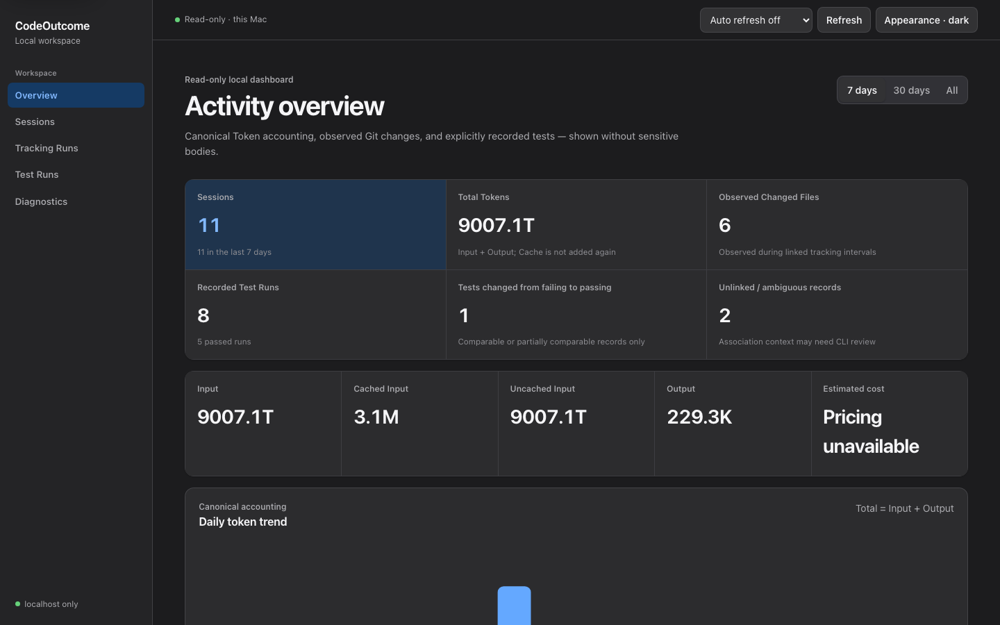
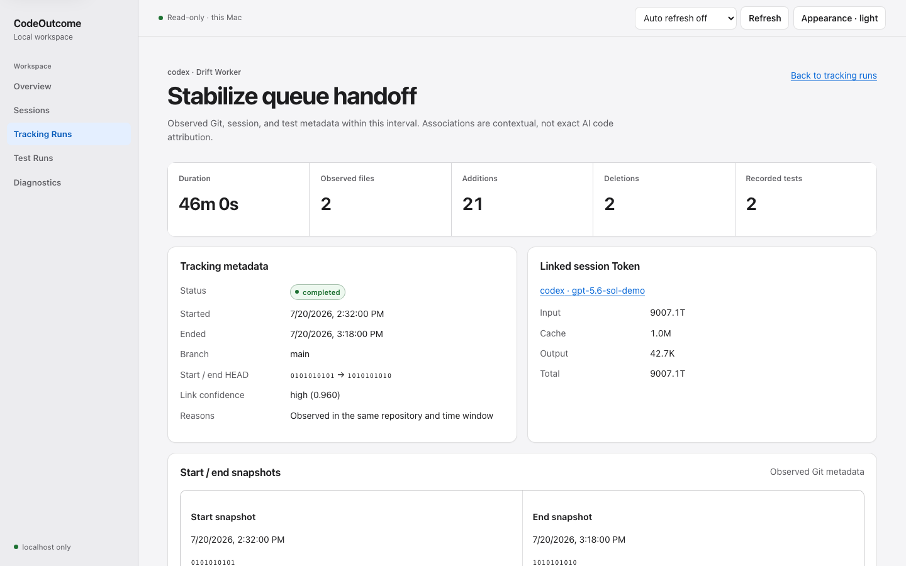
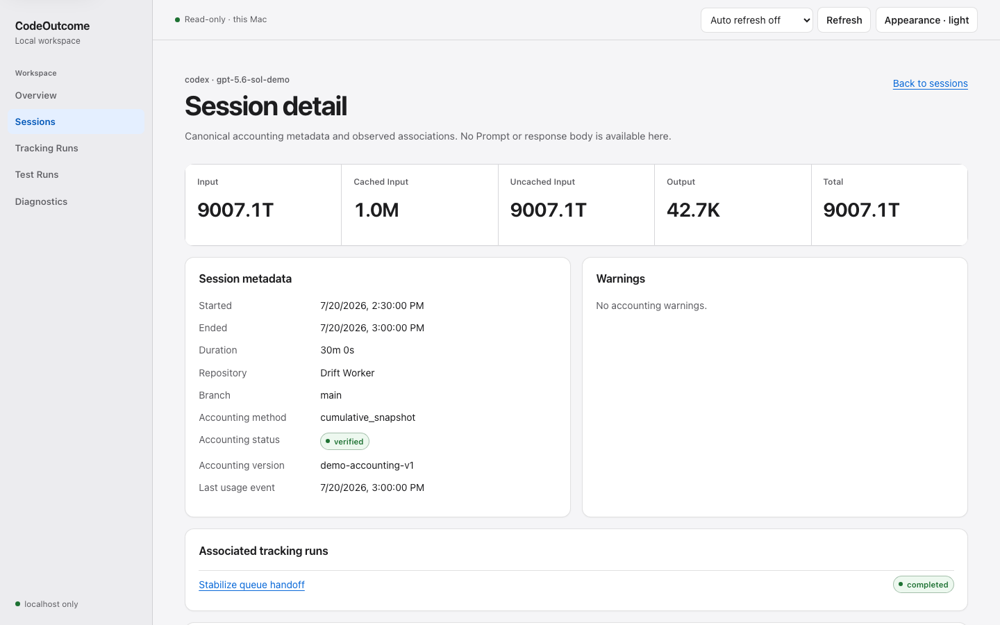

# Local Dashboard

CodeOutcome's Dashboard is a read-only local web interface over the existing
SQLite database. It is not a desktop application, remote service, or data entry
tool. It has no cloud sync, account system, remote access mode, or write action.

## Start

Build the browser assets once, then start the CLI-owned server:

```sh
pnpm dashboard:build
pnpm cli dashboard
```

The default is `127.0.0.1` with an available random port and automatic browser
opening. Alternatives:

```sh
pnpm cli dashboard --no-open
pnpm cli dashboard --port 4567
pnpm cli dashboard --host localhost --json
```

`--host` accepts only loopback hosts (`127.0.0.1`, another `127/8` address,
`localhost`, or `::1`). `0.0.0.0`, LAN addresses, and public addresses are
rejected. Press Ctrl-C to close the HTTP server and the database connection.

For a build-and-start development loop, use `pnpm dashboard:dev`. Run focused
tests with `pnpm dashboard:test`.

## Local security boundary

Each process creates a cryptographically random access token in memory. The
server injects it into the initial HTML meta element, and the browser sends it in
the `X-CodeOutcome-Dashboard-Token` header. The token is never placed in the URL,
database, configuration, CLI output, or Git. Restarting invalidates it.

The server validates Host, rejects a mismatched Origin, does not enable CORS,
rejects path traversal, and exposes neither arbitrary file reads nor SQL. It
sets Content Security Policy, `X-Content-Type-Options: nosniff`,
`Referrer-Policy: no-referrer`, and framing protection. Query parameters are
runtime validated, sort columns are whitelisted, and list sizes are capped at
200 (50 or fewer by default).

The boundary protects against accidental cross-origin access on the same
machine. It does not make the Dashboard safe to expose through port forwarding,
a reverse proxy, or a shared host. Remote access is intentionally unsupported.

## Read-only database behavior

The Dashboard uses a connection separate from writable CLI commands. SQLite is
opened with `readOnly: true`, `foreign_keys=ON`, and `query_only=ON`. Dashboard
startup and requests do not:

- create the database;
- run migrations;
- import logs;
- update timestamps or status rows;
- insert, update, delete, create, drop, or alter data.

Overview aggregation happens in SQLite. Lists are parameterized and paginated,
and the API never returns a raw `usage_events` list. Token values are serialized
as decimal strings to preserve integers larger than JavaScript's safe range.
Canonical Total is Input plus Output; Cached Input is already part of Input and
is not added a second time.

If the database is missing, the UI reports that `codeoutcome import` must be run
instead of creating an empty file. If the schema is older than migration 5, run
a normal writable CLI command such as `codeoutcome import` to apply migrations;
the Dashboard will not do so. Lock and integrity failures are returned as
sanitized errors without SQL or absolute paths.

## Pages

The committed images below are captured by Playwright from the deterministic,
fully synthetic Demo database at a fixed 1440×900 viewport. They are not mockups.








- **Overview** shows import state, session and Token totals, Provider/model
  distributions, daily trends, observed Git/test aggregates, comparable
  failing-to-passing changes, and recent metadata activity. Unknown pricing is
  shown as `Pricing unavailable`, never `$0`.
- **Sessions** provides Provider/model/repository/date/accounting filters,
  search, sorting, pagination, Token breakdown, and observed links.
- **Tracking Runs** shows start/end Git metadata, aggregate change counts,
  recorded tests, association confidence, status, warnings, and filtering.
- **Test Runs** shows aggregate execution/parser metadata with filters, sorting,
  pagination, and observed session/tracking associations.
- **Diagnostics** shows schema and migration state, foreign keys, query-only and
  integrity status, log directory readability, latest import, accounting/link
  warnings, active/running records, privacy mode, and a home-redacted database
  path. It provides CLI suggestions only—no repair, migration, import, or delete
  buttons.

Session, tracking, and test detail routes show metadata-only associations.
Tracking details combine session, snapshot, test, and lifecycle records into a
time-ordered timeline and show dynamic baseline/final comparisons.

## Privacy

The Dashboard does not request or display Prompt text, AI responses, source
code, complete Git diffs, raw stdout/stderr, stack traces, test-case bodies,
environment variables, credentials, cookies, access tokens, or source log file
paths. The API has explicit view contracts and does not expose SQLite rows.

In `git-metadata` mode, repository-relative Git metadata and home-redacted local
paths may appear. In `strict` mode, API repository paths become unavailable and
test commands display only the executable basename. Changing modes does not
erase historical rows; projection is enforced when Dashboard responses are
built.

## Refresh, display, and empty states

Use **Refresh** for an immediate read. Automatic refresh is off by default; the
available intervals are 30 and 60 seconds. The preference is UI-only and does
not write SQLite. Theme follows the system by default and can cycle through
light and dark; this preference stays in browser `localStorage`.

Dates arrive as ISO 8601 UTC and render in local time; hover shows the UTC value.
Compact Token totals expose their exact decimal value on hover. Charts include
text summaries, status labels include text/shape, and tables scroll horizontally
in narrow windows.

An empty Sessions or Tracking result means no record matches the current
filters. **No recorded test runs** means CodeOutcome has no explicitly wrapped
or imported test record; it is not the same as zero failed tests. When the
database has no underlying records, headline values that would be misleading as
zero display `unavailable`.

## Troubleshooting

- **Dashboard assets missing:** run `pnpm dashboard:build` before starting from
  source.
- **Database missing:** run `pnpm cli doctor`, then an explicit
  `pnpm cli import --provider all` if appropriate.
- **Schema outdated:** exit the Dashboard and run a normal writable CLI command
  that applies migrations. Re-run `pnpm cli doctor` before restarting.
- **Database locked or integrity warning:** stop other local CodeOutcome
  processes and run `pnpm cli doctor`. The Dashboard will not repair or delete
  files.
- **Provider log directory unavailable:** inspect Diagnostics and run
  `pnpm cli doctor`; configure paths through the documented environment
  variables rather than the UI.
- **Browser did not open:** copy the printed localhost URL, or start with
  `--no-open` intentionally.

The CLI remains responsible for importing logs, migrations, audit/reconcile,
tracking, test recording, configuration, and intentional deletion. The
Dashboard is presentation-only.
